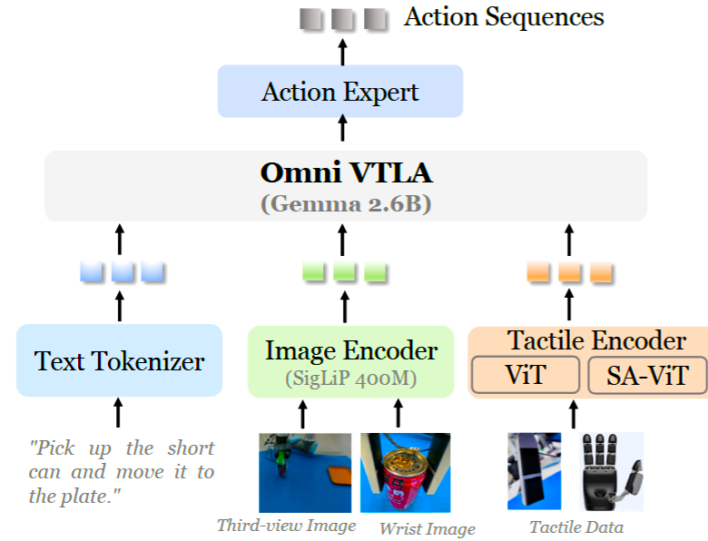
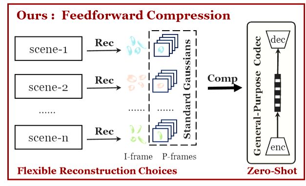

|  | **OmniVTLA: Vision-Tactile-Language-Action Model with Semantic-Aligned Tactile Sensing**   Zhengxue Cheng, Yiqian Zhang, Wenkang Zhang, Haoyu Li, Keyu Wang, Li Song, Hengdi Zhang   *In Submission, 2025*   [project](https://readerek.github.io/Objtac.github.io/) &#124; [arXiv](https://arxiv.org/abs/2508.08706) |
|---|---|

|  | **D-FCGS: Feedforward Compression of Dynamic Gaussian Splatting for Free-Viewpoint Videos**    Wenkang Zhang, Yan Zhao, Qiang Wang, Li Song, Zhengxue Cheng   *In Submission, 2025*   [arXiv](https://arxiv.org/abs/2507.05859) |
|---|---|

<!-- 可继续添加更多论文卡片，格式一致 -->

