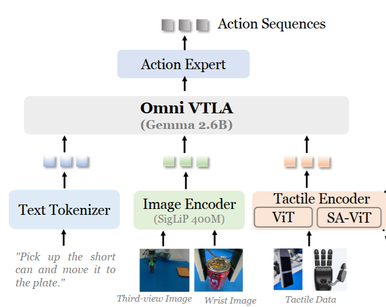
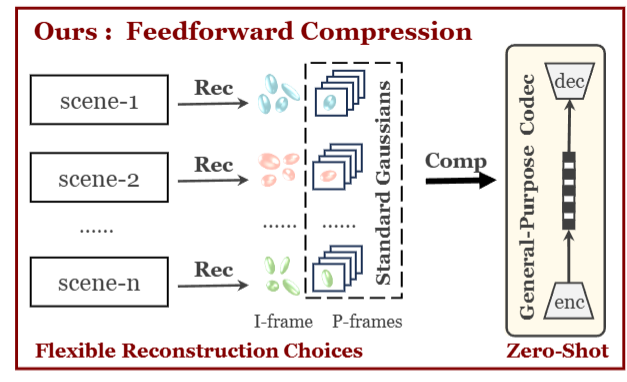

  
  

    
OmniVTLA: Vision-Tactile-Language-Action Model with Semantic-Aligned Tactile Sensing

    
Zhengxue Cheng, Yiqian Zhang, Wenkang Zhang, Haoyu Li, Keyu Wang, Li Song, Hengdi Zhang

    
In Submission, 2025

    

      <a href="https://readerek.github.io/Objtac.github.io/">dataset</a> |
      <a href="https://arxiv.org/abs/2508.08706">arXiv</a>
    

  

  
  

    
D-FCGS: Feedforward Compression of Dynamic Gaussian Splatting for Free-Viewpoint Videos

    
Wenkang Zhang, Yan Zhao, Qiang Wang, Li Song, Zhengxue Cheng

    
In Submission, 2025

    

      <a href="https://arxiv.org/abs/2507.05859">arXiv</a>
    

  

